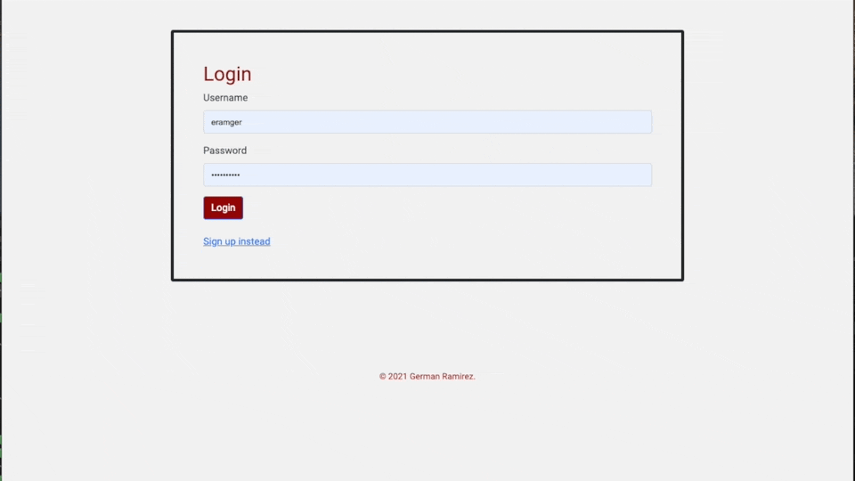

# Tech Blog


This blog is to share any post of technology where any user logged can add new topics , add comments on a post  or edit their own topics . This will help to growth the knowledge of the people subscribed 

## Table of Contents

- [Installation](#installation)
- [Usage](#usage)
- [License](#license)
- [Questions](#questions)

## Installation

Use the package manager [npm](https://docs.npmjs.com/cli/v7/commands/npm-install) to install all the dependencies that are on the package.json

```bash
npm install
```

## Usage

To Run the system you need to use the follow command

```bash
npm start
```

After that it will be necessary to change the file of .env.EXAMPLE to set the local settings from your enviroment

And execute the queries of schema.sql this will create the schema




## [Tech Blog GitHub Code](https://github.com/izaack89/tech-blog)

## [Tech Blog Live](https://izaack89.github.io/tech-blog/index.html)

## Tech Blog References

- [Sequelize](https://sequelize.org/master/) - Sequelize ORM Information
- [Express](https://expressjs.com/) - Express
- [mysql](https://www.npmjs.com/package/mysql) - Mysql NPM

## Questions

If you have any questions about the repository, open an issue or contact me directly at mitsuominagi@gmail.com. You can find more of my work at [izaack89](https://github.com/izaack89)

## Author

- **German Ramirez** - [GitHub](https://github.com/izaack89/)


